

# MCESP
### MECCHA CHAMELEON External ESP + Aimbot

A fully external ESP and aimbot for **MECCHA CHAMELEON**.

---

## Visual

<table>
<tr>
<td align="center" width="25%">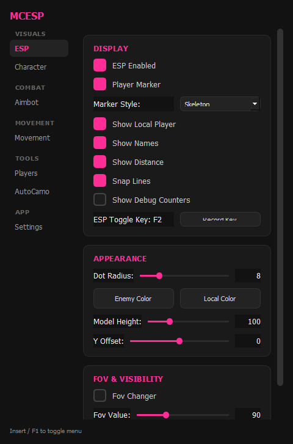 <b>ESP</b></td>
<td align="center" width="25%">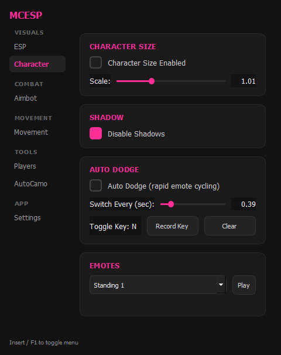 <b>Character</b></td>
</tr>
</table>

---

## Combat

<table>
<tr>
<td align="center" width="25%">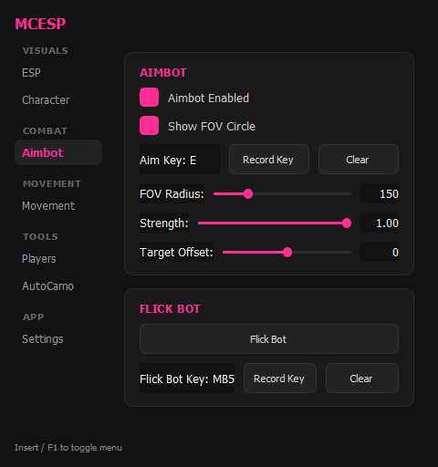 <b>Aimbot</b></td>
</tr>
</table>

---

## Movement

<table>
<tr>
<td align="center" width="25%">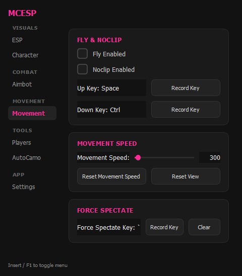 <b>Movement</b></td>
</tr>
</table>

---

## Tools

<table>
<tr>
<td align="center" width="25%">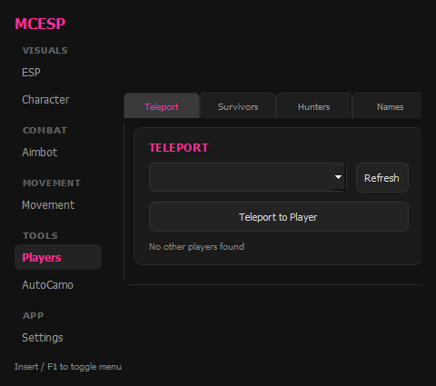 <b>Teleport</b></td>
<td align="center" width="25%">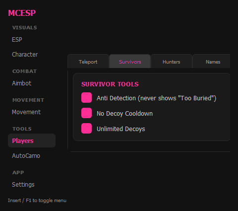 <b>Survivors (Hiders)</b></td>
<td align="center" width="25%">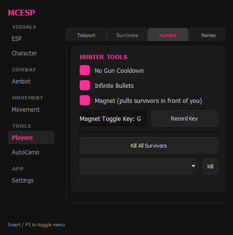 <b>Hunters (Seekers)</b></td>
<td align="center" width="25%">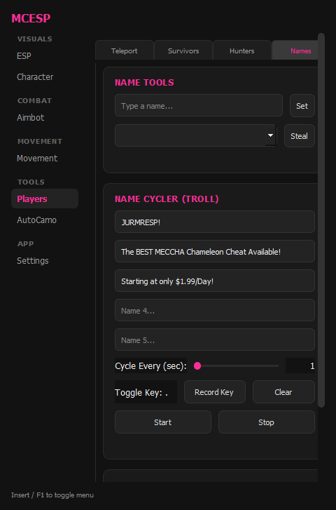 <b>Names</b></td>
</tr>
</table>

<table>
<tr>
<td align="center" width="25%">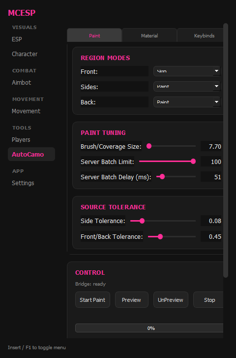 <b>Paint</b></td>
<td align="center" width="25%">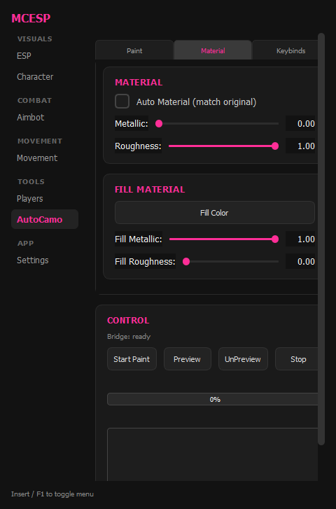 <b>Material</b></td>
<td align="center" width="25%">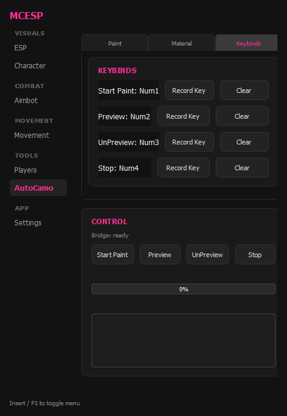 <b>Keybinds</b></td>
</tr>
</table>

---

## Settings

<table>
<tr>
<td align="center" width="25%">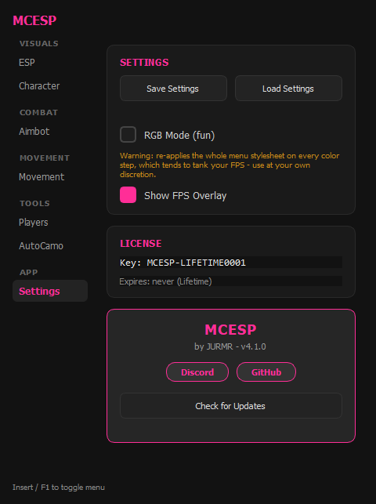 <b>Teleport</b></td>
</tr>
</table>

---
